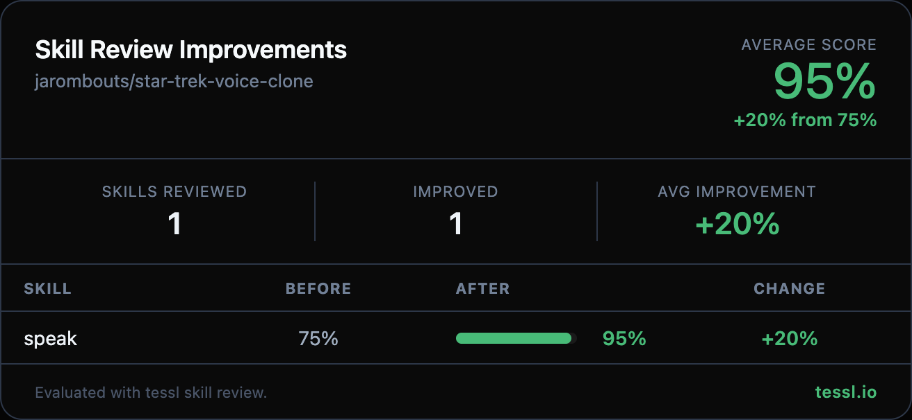

Hey 👋 @jarombouts

I ran your skills through `tessl skill review` at work and found some targeted improvements. Here's the full before/after:

| Skill | Before | After | Change |
|-------|--------|-------|--------|
| speak | 75% | 95% | +20% |

Changes made

- Expanded the `description` frontmatter with a "Use when..." clause listing natural trigger scenarios (read text aloud, say something out loud, announce a notification, play voice output)
- Added trigger keywords users would naturally use (`text-to-speech`, `read aloud`, `announce`, `voice output`) to improve skill discoverability
- Specified the TTS provider (ElevenLabs) in the description for better specificity
- Used quoted string format for the description field

The content body was already excellent (scored 100%) — concise, actionable, with great Trek-flavored examples. No changes needed there.

Honest disclosure — I work at @tesslio where we build tooling around skills like these. Not a pitch - just saw room for improvement and wanted to contribute.

Want to self-improve your skills? Just point your agent (Claude Code, Codex, etc.) at [this Tessl guide](https://docs.tessl.io/evaluate/optimize-a-skill-using-best-practices) and ask it to optimize your skill. Ping me - [@yogesh-tessl](https://github.com/yogesh-tessl) - if you hit any snags.

Thanks in advance 🙏
